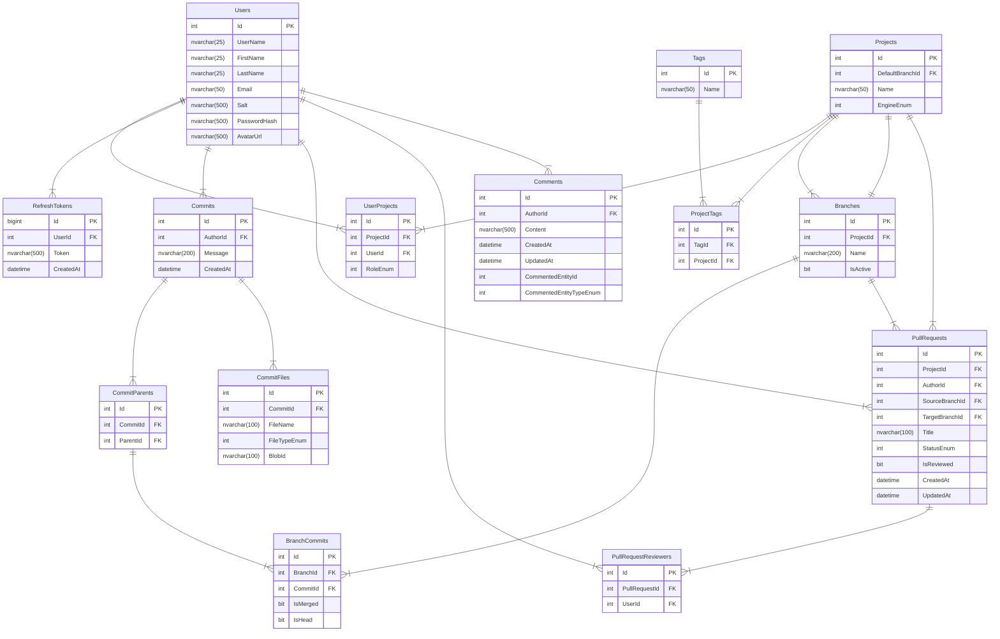

# BSA 2023 | .NET | Squirrel

**Technologies:**

Backend:

- Platform: .NET 6
- Network: REST, SignalR, RabbitMQ
- Database: MS SQL Server, Entity Framework Core
- Cloud: Azure
- Other: JWT, Docker

Frontend:

- Angular
- MaterialUI
- RxJS
- HTML5/CSS3/SASS

## Links:

- [Trello Board](https://trello.com/b/ByNYBIkT/squirrel)

## Building sources

By default, apps run on the following ports:

| Application                 | Port |
| --------------------------- | ---- |
| Squirrel.**Core**           | 5050 |
| Squirrel.**Notifier**       | 5070 |
| RabbitMQ                    | 5672 |

_Tip: If you want to connect to the specific service outside of docker, then use "localhost" as a service name, but if both services are inside docker, use service_name from a "docker-compose" file instead._

## Code quality

Make sure you read and follow [.NET Quality Criteria](https://github.com/BinaryStudioAcademy/quality-criteria/blob/production/src/dotnet.md).
Also, there are some best practices for frontend development: [Angular](https://angular.io/guide/styleguide) and [Typescript](https://google.github.io/styleguide/tsguide.html)

#### Docker:

1. Make sure you have [Docker](https://www.docker.com) and [Docker Compose](https://docs.docker.com/compose/install).
2. Pull this repo to your machine.
3. You can build and run all application containers via `docker-compose -f docker-compose.apps.yml up -d` command.
4. You can pull and run all 3rd-party services (MSSQL Server, RabbitMQ) via `docker-compose -f docker-compose.services.yml up -d` command.
5. Happy coding! :sunglasses:

#### Setup environment for local development:

1. Download and install [.NET 6 SDK](https://dotnet.microsoft.com/download).
2. It might be useful to have EF CLI. Install via command: _dotnet tool install --global dotnet-ef_
3. Download and install LTS version of [Node.js](https://nodejs.org/en/)
4. Install Angular-CLI via: _npm install -g @angular/cli_. _[What is Angular-CLI?](https://angular.io/cli)_

## Extensions for frontend development (required):

- ESLint (analysis tool that checks TypeScript\JavaScript code for readability, maintainability, and functionality errors)
- EditorConfig (helps maintain consistent coding styles for multiple developers working on the same project)

Some extra extensions which can significantly help to work with Angular:

- Angular Language Service (intelliSense for Angular templates)
- Angular Snippets
- Angular Schematics (working with Angular schematics via UI)

## Environment variables

This is a list of the required environment variables:

#### RabbitMQ

**RABBIT_MQ_USERNAME** - RabbitMQ username

**RABBIT_MQ_PASSWORD** - RabbitMQ user password

#### MSSQL Server

**SA_PASSWORD** - MSSQL Server "SA" user password

## SQL Server Database Schema

